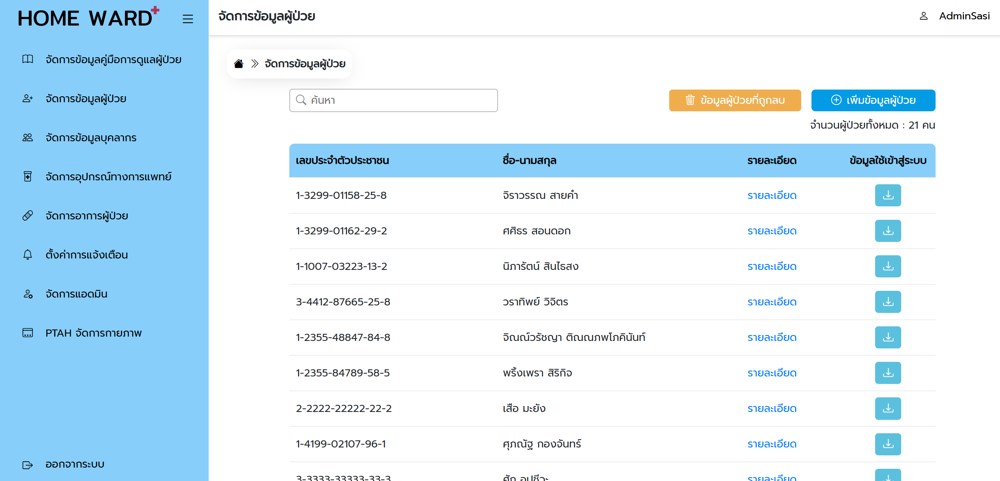

# 🏥 Home Ward - Admin



A web-based admin interface for managing patient care data in the Home Ward system.  
This interface allows administrators to oversee users, monitor system activities, and support care coordination for home-based patients.

🌐 **Live Demo:** [homeward.vercel.app](https://homeward.vercel.app)

🔐 **Demo Credentials:**

- **Username:** Admintest  
- **Password:** test8800  

---

## 🚀 Project Overview

This admin platform is part of the Home Ward system, designed to assist medical teams in managing patient care remotely.  
It provides centralized tools for managing caregivers, medical staff, patient data, care guides, and more.

Built with **React.js** , the system focuses on usability, responsiveness, and data accuracy.

---

## 🧑‍💼 Admin Features

This interface supports comprehensive control over the Home Ward ecosystem, helping streamline collaboration and care workflows.

### ✅ Key Functions

- Manage patient and caregiver records (add, edit, delete)  
- Manage medical personnel and admin users  
- Add, edit, and delete patient care guides  
- Manage medical equipment and symptom data  
- Search data across users, guides, equipment, and more  
- Configure notification settings  


---

## 🛠 Tech Stack

- **Frontend:** React.js
- **Backend:** Node.js, Express.js, and MongoDB (RESTful APIs)
- **Design Tool:** Figma  
- **Deployment:** Vercel

---

## 🧪 Getting Started

This project was bootstrapped with [Create React App](https://github.com/facebook/create-react-app).

### ▶️ Run the App Locally

```bash
npm install
npm start
